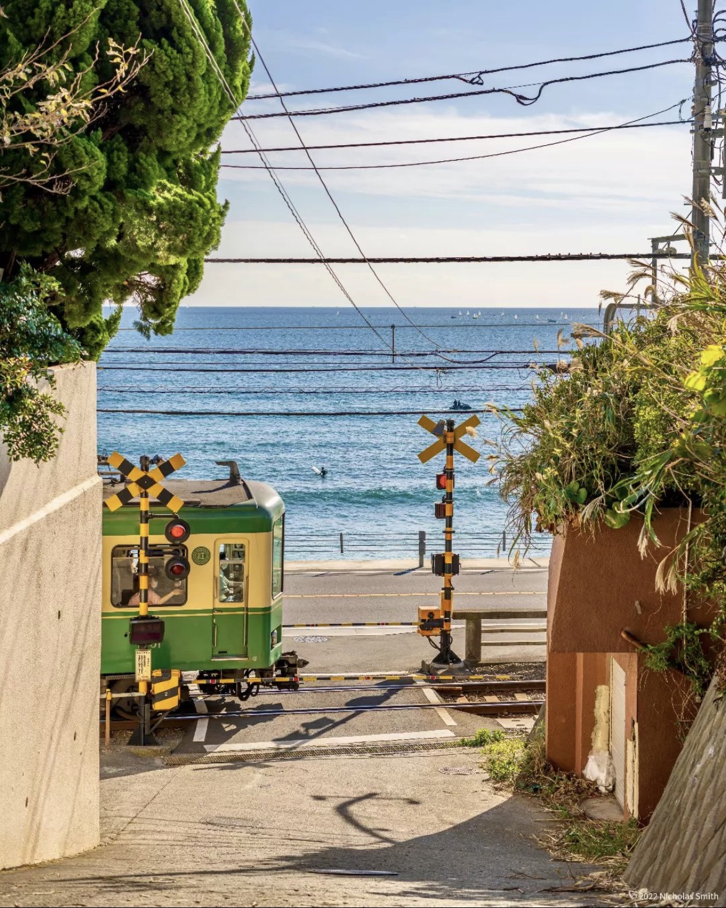

꿈에서는 행복하지만 깼을 때 착잡해지는 이런 꿈은 악몽이라고 볼 수 있을까?

꿈은 위에 보이는 사진과 비슷한 풍경이었다. 처음 시작된 곳이 저런 풍경은 아니었지만 곧 저런 풍경의 장소로 이동하는 꿈이엇다.
사진처럼 바로 바다가 보이는 것은 아니였고, 카페 옆의 길을 따라서 10초정도만 걸으면 사진과 같이 바다의 풍경이 확 들어오는 곳이었다.

어떻게 보면 내가 원한 모습이었지만 꿈에서 깨어났을 때는 기분이 그냥.. 뭐랄까 안좋았다.

아마 인생 살면서 다시 돌아갈 수 없는 부분이기도 하면서, 다시 이루어지기 굉장히 어렵다는 것을 속으로 알고 있기 때문이지 않을까 싶다.

최근에 꿈을 상당히 자주 꾸는 것 같다. 이런 기분 나쁜 꿈의 비중이 한 60%는 되는 것 같다.

아마 군대에서 교대근무를 서면서 생활패턴이 불규칙해져서 이런게 아닌가 싶기도 하고.. 또 생각해보면 그렇지도 않은데 최근에 꿈을 자주 꾸는 이유를 모르겠다.

꿈이 깨기 전에는 행복했지만 꿈에서 깨어나면 굉장히 착잡해지는 이런 꿈은 다시는 꾸고 싶지 않다.
